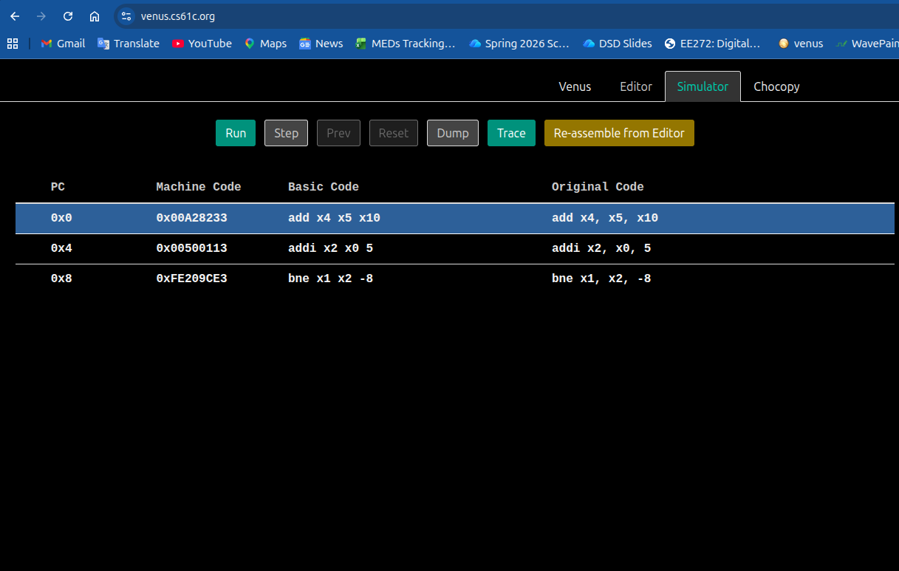

# 0x00A28233

**Binary** : 0000_0000_1010_0010_1000_0010_0011_0011\
**opcode[6:0]**    : 0110011  -> R-Type\
**rd[11:7]**       : 00100    -> x4\
**funct3[14:12]**  : 000      -> add/sub\
**rs1[19:15]**     : 00101    -> x5\
**rs2[24:20]**     : 01010    -> x10\
**funct7[31:24]**  : 00000000 -> add
### add x4, x5, x10
---
# 0x00500113

**Binary** : 0000_0000_0101_0000_0000_0001_0001_0011\
**opcode[6:0]**    : 0010011  -> I-Type\
**rd[11:7]**       : 00010    -> x2\
**funct3[14:12]**  : 000      -> addi\
**rs1[19:15]**     : 00000    -> x0\
**imm[31:20]**     : 000000000101 -> 5

### addi x2, x0, 5
---
# 0xFE209CE3

**Binary** : 1111_1110_0010_0000_1001_1100_1110_0011\
**opcode[6:0]**    : 1100011  -> B-Type\
**imm[12]**        : 1\
**imm[10:5]**      : 111111\
**rs2[24:20]**     : 00010    -> x2\
**rs1[19:15]**     : 00001    -> x1\
**funct3[14:12]**  : 001      -> bne\
**imm[4:1]**       : 1100\
**imm[11]**        : 1\
**imm**            : 111111111100 -> -8

### bne x1, x2, -8
---
# Venus Verification

