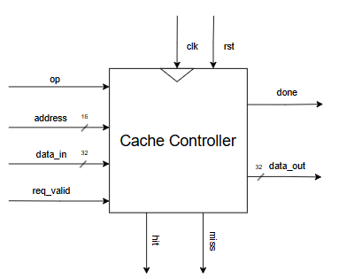
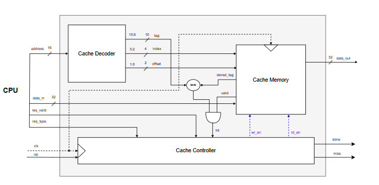
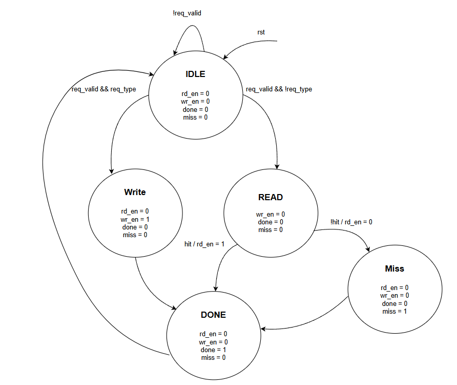

# 4. Cache Controller Architecture

## 4.1 Overview

The proposed cache controller implements a **Direct-Mapped Cache**. In a direct-mapped organization, every memory block has exactly one possible location within the cache. This approach provides a simple hardware implementation, fast address decoding, and low access latency, making it suitable for FPGA-based designs and educational processor implementations.

The controller supports two operations:

- Read
- Write

For every request, the controller decodes the incoming address, determines whether the requested cache line is present by comparing the stored tag with the requested tag, and performs the required cache operation.

---

## 4.2 Top-Level Architecture

Figure 4.1 illustrates the top-level interface of the cache controller.

<p align="center">

</p>

The CPU communicates with the cache controller using the following signals:

| Signal | Description |
|---------|-------------|
| `clk` | System clock |
| `rst` | Resets the controller and invalidates cache contents |
| `req_valid` | Indicates a valid cache request |
| `req_type` | Operation type (Read/Write) |
| `address` | Memory address |
| `data_in` | Data to be written |
| `data_out` | Data returned during read operations |
| `done` | Indicates completion of the cache request |
| `miss` | Indicates that the requested cache block is not present |

---

## 4.3 Internal Architecture

Figure 4.2 presents the internal organization of the direct-mapped cache controller.

<p align="center">

</p>

The architecture is divided into three functional blocks:

- Cache Decoder
- Cache Memory
- Cache Controller

### Cache Decoder

The cache decoder divides the incoming memory address into three fields:

- Tag
- Index
- Word Offset

The **Index** uniquely selects one cache line because this implementation follows a direct-mapped organization. The **Tag** identifies whether the selected cache line contains the requested memory block, while the **Word Offset** selects one of the four words stored inside the selected cache block.

### Cache Memory

The cache memory consists of three storage arrays:

- Data Array
- Tag Array
- Valid Bit Array

Each cache line stores:

- Four 32-bit words
- One tag
- One valid bit

The valid bit indicates whether the cache line contains valid data. During a write operation, the selected word, tag, and valid bit are updated. During a read operation, the stored tag, valid bit, and requested word are returned to the controller.

### Tag Comparator

The incoming tag generated by the decoder is compared with the stored tag read from the cache memory.

The cache hit signal is generated as

```text
Hit = Valid AND (Incoming Tag == Stored Tag)
```

If a hit occurs, the requested word is returned to the processor. Otherwise, a cache miss is generated.

---

## 4.4 Controller FSM

The controller operation is implemented using the finite state machine shown in Figure 4.3.

<p align="center">

</p>

The controller consists of five states.

### IDLE

The controller waits for a valid request from the processor. When `req_valid` becomes high, the controller determines the requested operation and transitions to either the READ or WRITE state.

### READ

The cache memory is accessed using the decoded index and word offset. The stored tag is compared with the incoming tag.

- If the tags match and the valid bit is asserted, the requested data is returned and the controller enters the DONE state.
- Otherwise, the controller enters the MISS state.

### WRITE

The selected cache word is updated using the incoming data. The corresponding tag is stored and the valid bit is asserted. After the write operation completes, the controller transitions to the DONE state.

### MISS

The MISS state indicates that the requested block is not available in the cache. The controller asserts the `miss` signal before proceeding to the DONE state.

### DONE

The DONE state generates a one-cycle `done` pulse to notify the processor that the requested cache operation has completed. The controller then returns to the IDLE state and waits for the next request.

---

## 4.5 Operation Flow

The complete operation of the direct-mapped cache controller is summarized below:

1. The processor issues a valid read or write request.
2. The cache decoder extracts the tag, index, and word offset.
3. The index selects the corresponding cache line.
4. The stored tag and valid bit are read from the cache memory.
5. The incoming tag is compared with the stored tag.
6. If a valid tag match exists, the requested word is returned from the selected cache block.
7. Otherwise, a cache miss is generated.
8. After completing the request, the controller asserts the `done` signal and returns to the IDLE state.